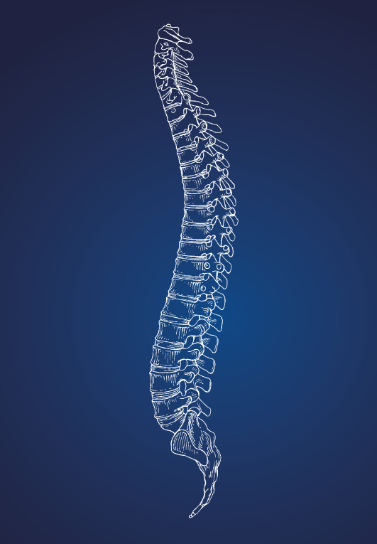

## Hexenschuss (Lumbago)

Oft löst eine falsche Bewegung, etwa das Anheben eines schweren Gegenstandes, heftige Schmerzen in der unteren und mittleren Lendenwirbelsäule aus. Der Betroffene hat das Gefühl, im Kreuz durchzubrechen und ist aufgrund der Schmerzen nahezu bewegungsunfähig. Die Schmerzen strahlen gelegentlich in ein Bein aus, gehen jedoch nicht über das Kniegelenk hinaus. 

Genauso vielfältig wie die Symptome sind die Ursachen. Im Prinzip ist 
Rückenschmerz der Preis, den der Homo sapiens für den aufrechten Gang zahlt. Die Muskeln der Lendenwirbelsäule müssen im Wechselspiel mit der 
Bauchmuskulatur ununterbrochen Feineinstellungen vornehmen, um zu
verhindern, dass wir nach vorne oder nach hinten fallen. Tauchen hier Störfaktoren auf, gerät dieses Zusammenspiel schnell aus den Fugen. Das heißt mit anderen Worten: Schmerzen an der Lendenwirbelsäule (auch Lumbago genannt) sind überwiegend muskulär bedingt. Einige weitere Faktoren begünstigen das Auftreten der unteren Rückenschmerzen: Eine angeborene ausgeprägte Hohlkreuzform, eine ausgeprägte Beinlängendifferenz, Sportarten, die mit einer ausgeprägten Hohlkreuzbildung einhergehen, schwere körperliche Arbeit, aber auch Bildschirmarbeit.

### Behandlung

* Spritzen
* Medikamentöse Therapie
* Krankengymnastik
* Fango
* Massagen
* Elektrotherapie
* Wärmebehandlung
* Im Falle der Blockade eines oder mehrerer Wirbelgelenke hilft die Chirotherapie (Einrenken)

## Bandscheibenvorfall

Für Schmerzen am unteren Teil der Wirbelsäule werden immer wieder vorschnell Bandscheibenvorfälle verantwortlich gemacht. In der Mehrzahl der Fälle haben die Beschwerden jedoch nichts mit der Bandscheibe zu tun, es handelt sich vielmehr um Lumbago. 

An der gesamten Wirbelsäule liegen zwischen den eigentlichen knöchernen Wirbeln die Bandscheiben, die als Puffer gegen Stossbelastungen dienen. Wenn diese Scheiben allzu beweglich werden, können sie auf Rückenmark oder Nervenwurzeln drücken. Relevant wird ein Bandscheibenvorfall vor allem dann, wenn er andere Gewebe beeinträchtigt bzw. Raum beansprucht, den andere Strukturen wie zum Beispiel eine Nervenwurzel benötigen, um störungsfrei funktionieren zu können. Wird eine Nervenwurzel durch einen Bandscheibenvorfall bedrängt, treten Symptome in dem Versorgungsgebiet des betroffenen Nervs auf. Dabei ist nie das ganze Bein betroffen, sondern z.B. die Außenseite von Ober- und Unterschenkel. Charakteristisch sind auch ein Pelzigkeitsgefühl oder eine Taubheit in bestimmten Bereichen. Im schlimmsten Fall treten Schwächegefühle bestimmter Muskeln auf – der Fuß kann etwa nicht mehr gehoben werden. 

### Behandlung

Wenn die Bandscheibe vorgewölbt ist und auf einen in das Bein strahlenden Nerv drückt, kann eine CT-gesteuerte Injektion sinnvoll sein. Als letzte Instanz bleibt bei schwerwiegenden Bandscheibenvorfällen mit entsprechend gravierenden Nervenausfällen die Bandscheiben-OP, die in der Regel von Neurochirurgen durchgeführt wird.

## Unfallchirurgie

Sekundär (mit zeitlicher Verzögerung) versorgbare Frakturen (Handgelenksfraktur, Mittelhandfraktur, Fingerfraktur, knöcherne Strecksehnenruptur, Sehnenverletzung der Hand, Sprunggelenksfraktur