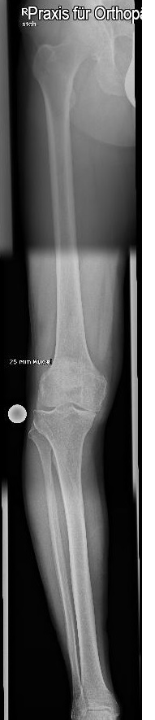
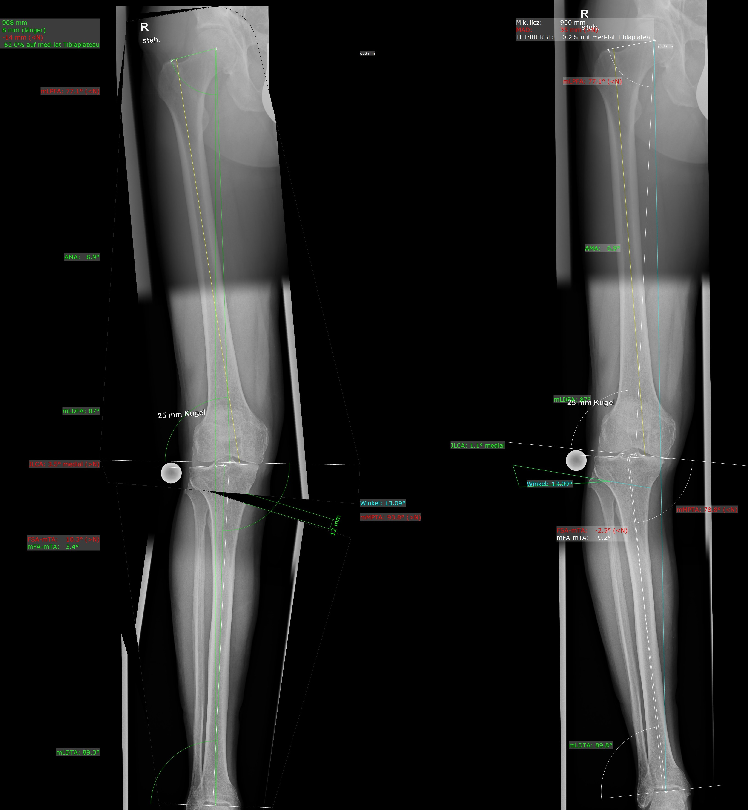
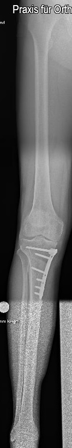

## Meniskusoperation 

Je nach Art und Größe des Risses wird der Meniskus genäht oder teilweise entfernt. Beide Eingriffe erfolgen ausschließlich arthroskopisch, d. h. durch eine Schlüsselloch-Operation 

### Meniscusnaht oder Meniscusrefixation: 

Viele Meniskusverletzungen lassen sich heute wieder nähen oder an der ursprünglichen Position des Meniskus fixieren. Dies hängt von der Lokalisation des Meniskusrisses und der dortigen Durchblutung des Meniskus ab. Handelt es sich um einen direkt an der Kapsel befindlichen oder nicht zu langen Meniskusriss, kann dieser genäht werden. 

### Meniskusteilentfernung oder Meniskusteilresektion 

Nur der kaputte Teil des Meniskus wird entfernt. Hierdurch erhält man einen stabilen, runden Rest-Meniskus, der dann nicht weiter einreißt. Die puffernde und stabilisierende Wirkung des Meniskus bleibt erhalten. 

## Kreuzbandoperation 

Bei der Kreuzbandplastik kommt kein Plastik zum Einsatz. Der Begriff steht vielmehr für Kreuzband-Ersatzoperationen. Bei den durchgeführten Methoden der Kreuzbandoperation (Semitendinosus- oder Patellasehnen-Methode) wird dem Bein eine körpereigene, entbehrbare Sehne entnommen, die dann arthroskopisch als Kreuzband in das Knie eingebaut wird. Es entstehen also nur kleinste Narben. Nach der Kreuzbandoperation / Kreuzbandplastik ist das Knie wieder stabil. 

## Knorpelchirurgie

### Knorpelglättung

Wenn der Knorpel, der im Gelenk den Knochen umgibt, wie ein alter Teppich aufgefranst ist, wird er mit einem speziell dafür geschaffenen Instrument, dem „Shaver“ (dt. Rasierer) geglättet. Eine solche Knorpelglättung kann eine erhebliche Schmerzlinderung bewirken. 

Der Eingriff erfolgt ausschließlich arthroskopisch .

### Mikrofrakturierung 

Bei tieferen Knorpelschäden, die bis auf den darunterliegenden Knochen reichen, kommt die Mikrofrakturierung zur Anwendung . Hierbei wird die äußere Knochenschicht mit einem kleinem, spitzem Stößel oder einem Bohrdraht durchbrochen. Dadurch entsteht eine Verbindung zum darunter liegenden Knochenmark. Das aus der Knochenwunde austretende Blut spült Stammzellen an die Oberfläche, die am freiliegenden Knochen anhaften. Hierdurch entsteht neues Knorpelgewebe (Faserknorpel), das dem ursprünglichen Knorpel ähnelt. 

Der Eingriff erfolgt ausschließlich arthroskopisch.

## Implantation einer Kniegelenksendoprothese 

Erst wenn es bei arthrotischen Veränderungen des Kniegelenkes trotz konservativer Behandlung nicht mehr zu einer Besserung der Beschwerden kommt, wenn etwa Ruheschmerzen auftreten oder es zu einer Verformung des Kniegelenkes mit Veränderung der Beinachse kommt, ist der Ersatz des Gelenkes unumgänglich. Die Versorgung erfolgt als stationäre Operation. 

Ist bei der Kniegelenkarthrose nur eine Gelenkseite betroffen kann eine Teilprothese zum Einsatz kommen (Schlittenprothese). 

## Umstellungsosteotomie 

Eine Achsfehlstellung des Beines sog. X oder O Bein kann angeboren oder erworben sein. Diese Fehlstellung führt meistens zu einem vorzeitigem Gelenkverschleiß. Durch eine Umstellungsoperation kann die anatomische Beinachse wiederhergestellt und so der Verschleißprozeß verlangsamt werden. Bei der Operation wird nach einem Hautschnitt ein Knochenschnitt angelegt. Dieser ermöglicht das Bein korrekt auszurichten. Eine am Knochen mit Schrauben fixierte Platte sichert bis zur Heilung des Knochenschnittes über 6 Wochen das OP-Ergebnis. Zu sehen sind Röntgenbilder vor und nach der Operation sowie in der Mitte die OP-Planungsskizze unter Verwendung einer Planungssoftware.  

Die Versorgung erfolgt als stationäre Operation.